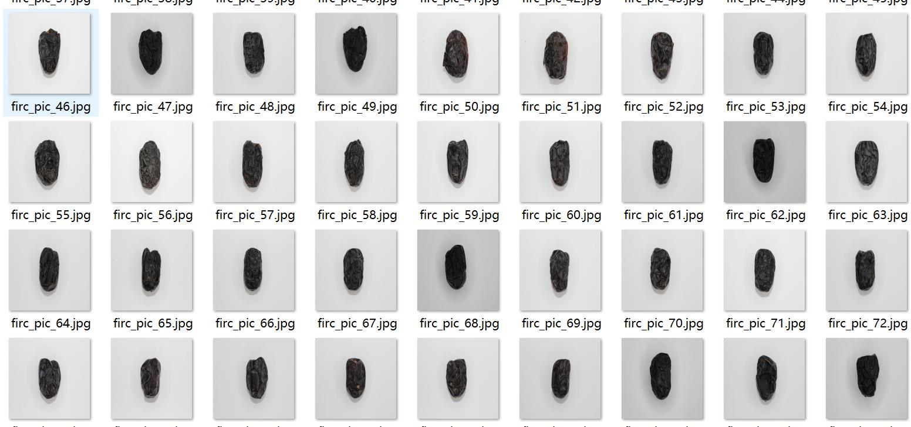
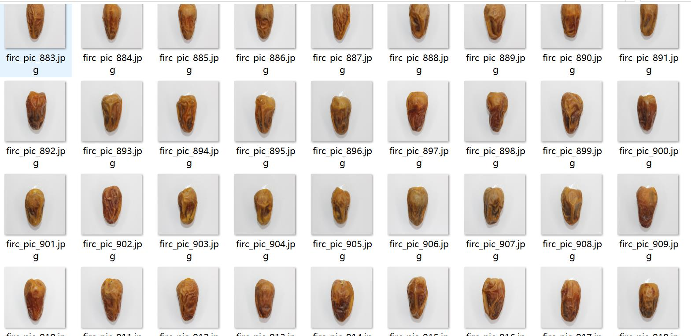
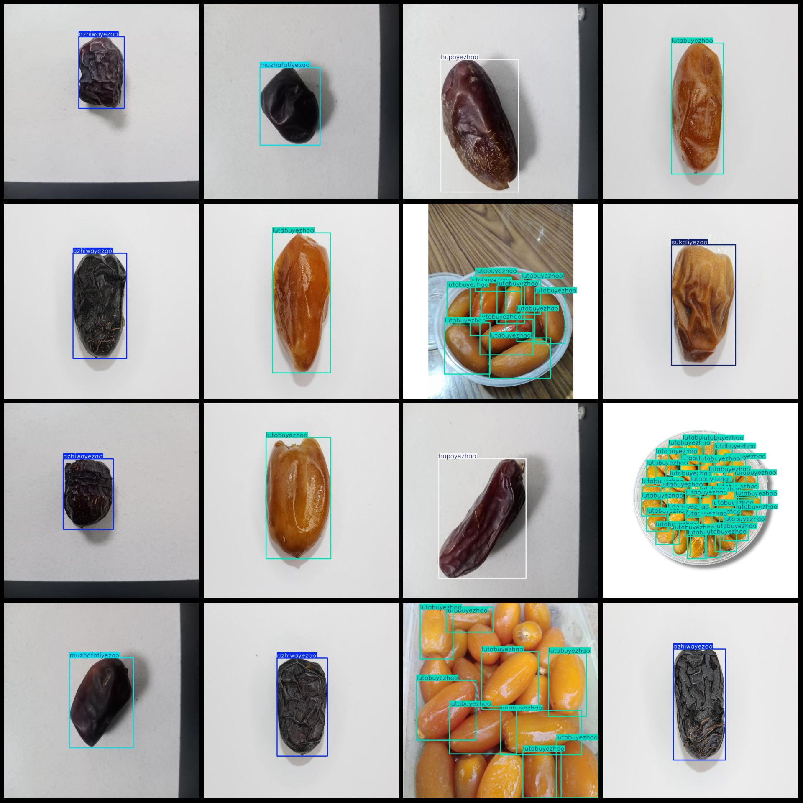
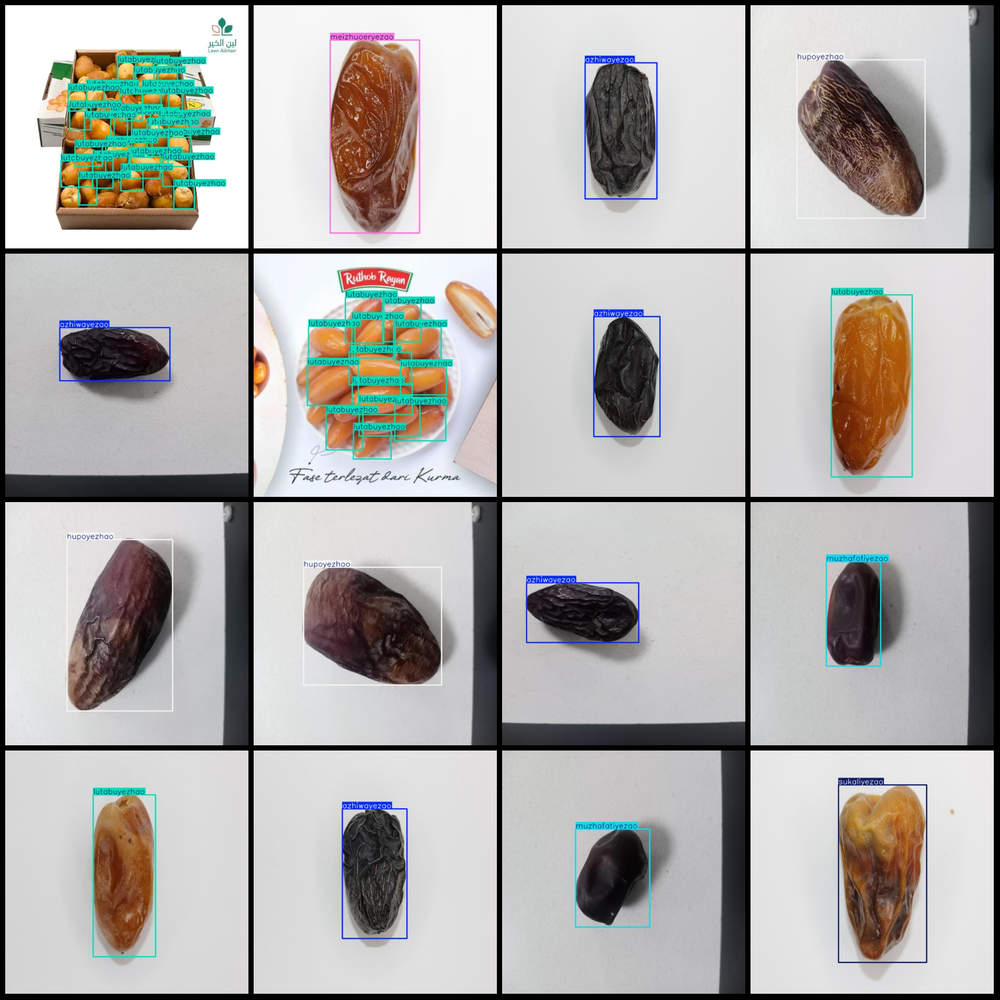

# Data Set: Detecting Different Types of Jujubes in VOC+YOLO Format with 1,102 Images and 6 Categories

Dataset format: Pascal VOC format + YOLO format (txt files without split paths, only containing jpg images and corresponding VOC format xml files and yolo format txt files)
Number of images (jpg file count): 1102
Number of annotations (xml file count): 1102
Number of annotations (txt file count): 1102
Number of categories: 6
Category names in the annotation files (notice that the order of categories in the yolo format does not correspond to this, but is based on the "labels" folder's "classes.txt"): ["azhiwayezao", "hupoyezhao", "lutabuyezhao", "meizhuoeryezao", "muzhafatiyezao", "sukaliyezao"]
["Azhwa", "Amber Date", "Rutabaga Date", "Mezzo-Tartar Date", "Mazfatiya Date", "Sukari Date"]
Number of boxes for each category:
azhiwayezao = 305
hupoyezhao = 136
lutabuyezhao = 1067
meizhuoeryezao = 119
muzhafatiyezao = 136
sukaliyezao = 247
Total number of boxes: 2010
The number of images per category:
- azhiwayezao images = 303
- hupoyezhao images = 136
- lutabuyezhao images = 180
- meizhuoeryezao images = 119
- muzhafatiyezao images = 136
- sukaliyezao images = 232
Image resolution: 640x640
Using labelImg for labeling:
Labeling rules: draw a square around the category.
Important Notes: The dataset is not split into training, validation, and test sets; you need to divide these yourself.
Special Remarks: This dataset does not guarantee the accuracy of the trained model or the weights file.
Image Preview:
## Images

Here is a pay link on Stripe ( https://buy.stripe.com/3cs8yP7sY87d0vu9AB ). Please contact me lonlonago@foxmail.com after funding $89, and I will send you a complete data files , thank you!

